# 👨‍💻 Alisson Freittas

**`Desenvolvedor FullStack`**

Olá! 👋 Me chamo **Alisson Freitas**, sou desenvolvedor **Full-Stack** e graduando em **Engenharia de Software** pela Universidade Estácio, com base em Sorocaba/SP.

Minha paixão por tecnologia começou na infância, movido pela curiosidade de desmontar e fuçar em computadores para entender exatamente como cada peça funcionava por dentro. Tive meu primeiro contato com desenvolvimento web em **2005**, criando e customizando templates em HTML na época do Orkut. Ali nascia uma vocação que só cresceu ao longo dos anos.

Com mais de uma década de bagagem prática em infraestrutura, redes e resolução de problemas técnicos, desenvolvi uma forte visão sistêmica e investigativa. Hoje, à frente do meu estúdio (**AF Stack Studio**), projeto e construo aplicações web modernas, plataformas SaaS completas e sistemas sob medida, combinando o ecossistema **TypeScript, React, Next.js, Node.js e PostgreSQL** com arquitetura sólida, foco em segurança de dados e alta performance.

---

### 🤖 Linguagens

 
 

### 📊 Estatísticas

  

  

